# Devops session 2023 (Part 3)

## Assignment

- Auto scaling group with launch template
  https://github.com/Kushalkhadka7/aws-asg-terraform

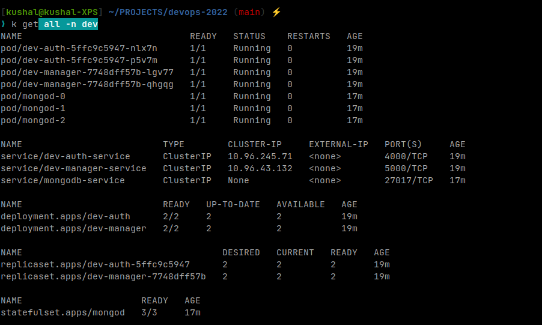
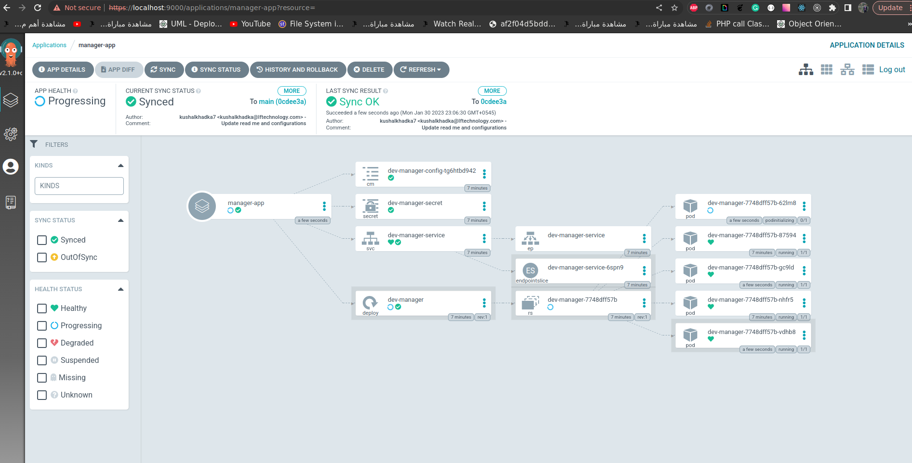
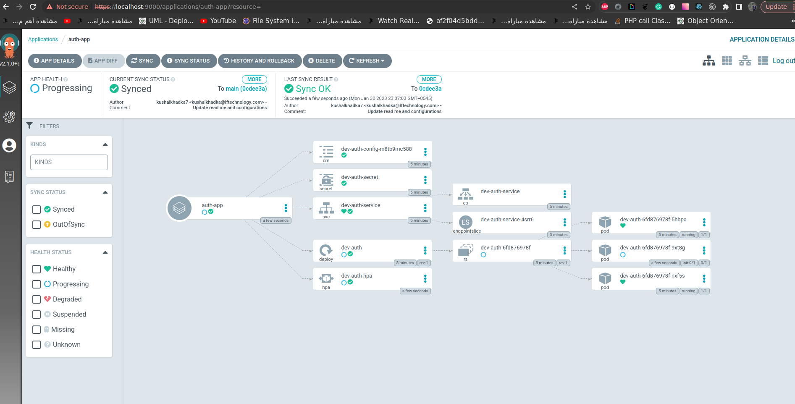
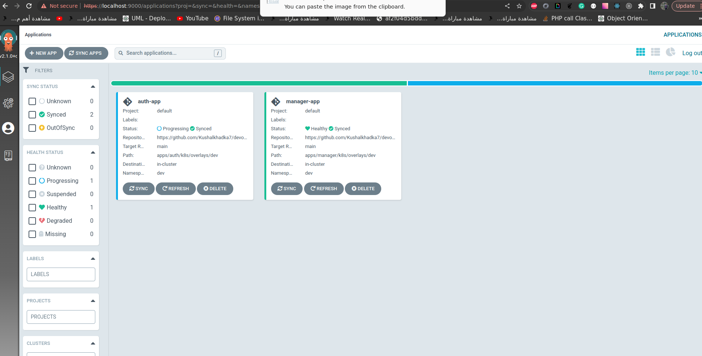
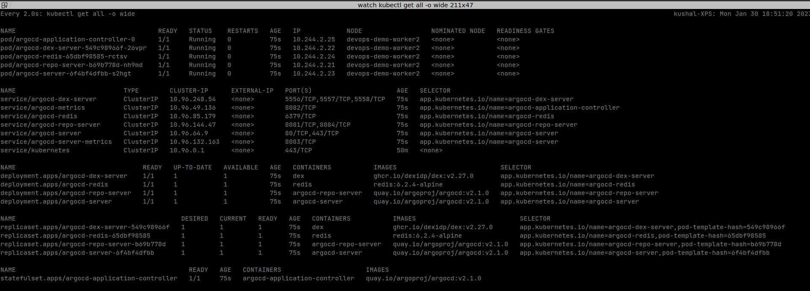
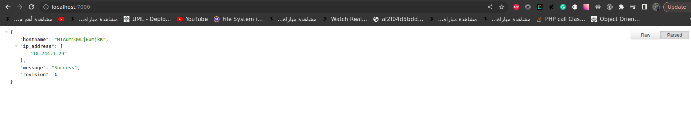
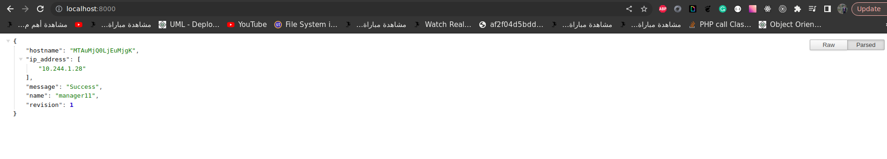
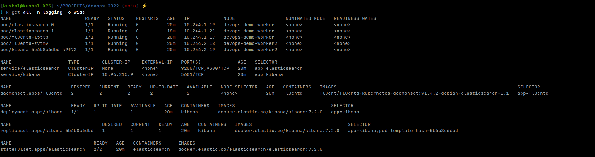
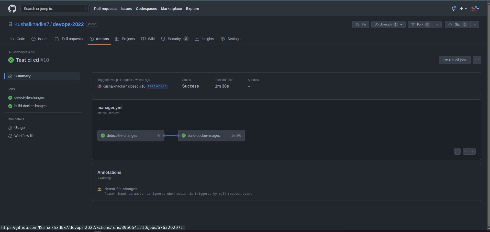

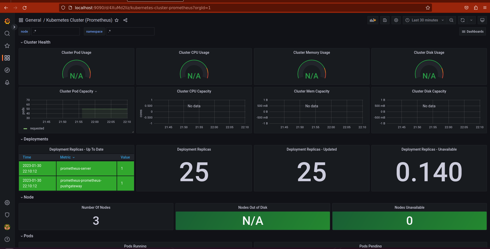
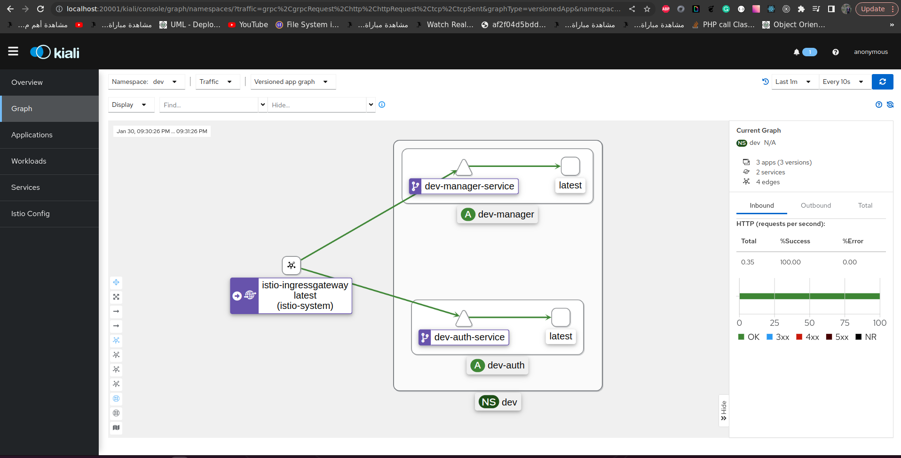
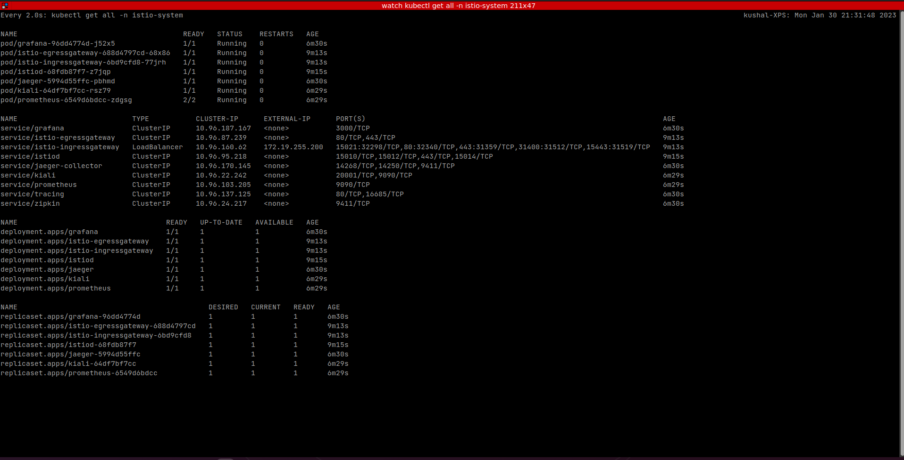
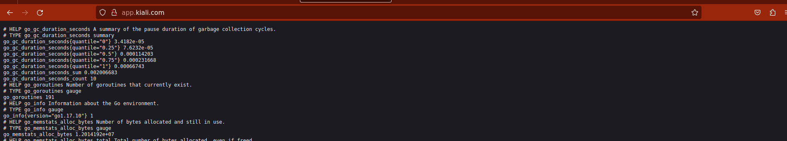
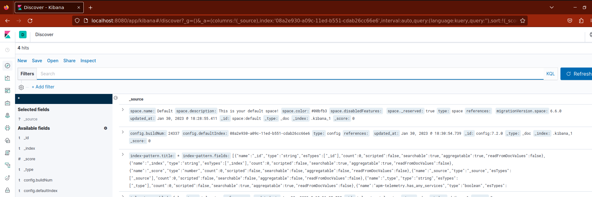

## Requirements

- docker
- aws
- istio
- helm
- kubectl
- kustomize

## Steps to run locally

`All of these will be on cluster name devops-demo`

---

### Create infrastructure

- Create kind cluster with 2 worker nodes

  ```
  # Delete clusters if exists any.

  make delete-clusters

  # Creates kind cluster devops-demo

  make cluster

  # This will create a cluster with 1 master node and 2 worker nodes.
  ```

- Deploy metric server

  ```
  # Deploy metric server on the cluster

  make deploy-metric-server
  ```

- Deploy metallb overlay network to kind cluster

  ```
  # Deploy metallb overlay network

  make deploy-metal-lb
  ```

- Label one of the node to dev
  ```
  kubectl label nodes devops-demo-worker env=dev
  ```
- Create namespace and define request quota
  ```
  make ns-quota
  ```

### Deploy database

- Deploy mondo-db database
  ```
  make deploy-mongo-db
  ```

### Deploy applications

- Deploy application

  ```
  cd apps/manager && make apply

  cd apps/auth && make apply
  ```

### Deploy efk stack

- Deploy efk
  ```
  make deploy-efk
  ```

### Deploy argo cd

- Deploy argo infrastructure

  ```
  make deploy-argocd
  ```

- Deploy argo apps
  ```
  make create-argo-apps
  ```

### Deploy monitoring

```
make deploy-monitoring
```

### Deploy istio ingress

- Copy istio binary

  ```
  # Install and verify the istioctl installation

  make install-istio-binary
  ```

- Deploy istio infrastructure

  ```
  istioctl install-istio-profile
  ```

- Enable istio injection for name spaces

  ```
  make enable-istio-injection
  ```

- Restart the pods on dev namespace
  ```
  make reload-pods
  ```
- Deploy ingress gateway
  ```
  make deploy-ingress-gateway
  ```
- Deploy virtual services
  ```
  make deploy-virtual-services
  ```

## Test the app running

- Update the /etc/hosts file with the ip address of the cluster

  ```
  <cluster ip> app.manager.com
  <cluster ip> app.auth.com
  <cluster ip> app.kiali.com

  ```

- Browse the app

  ```
  - manager.com will redirect to manager app
  - auth.com will redirect to auth app
  - kiali.com will redirect to kiali dashboard
  ```
